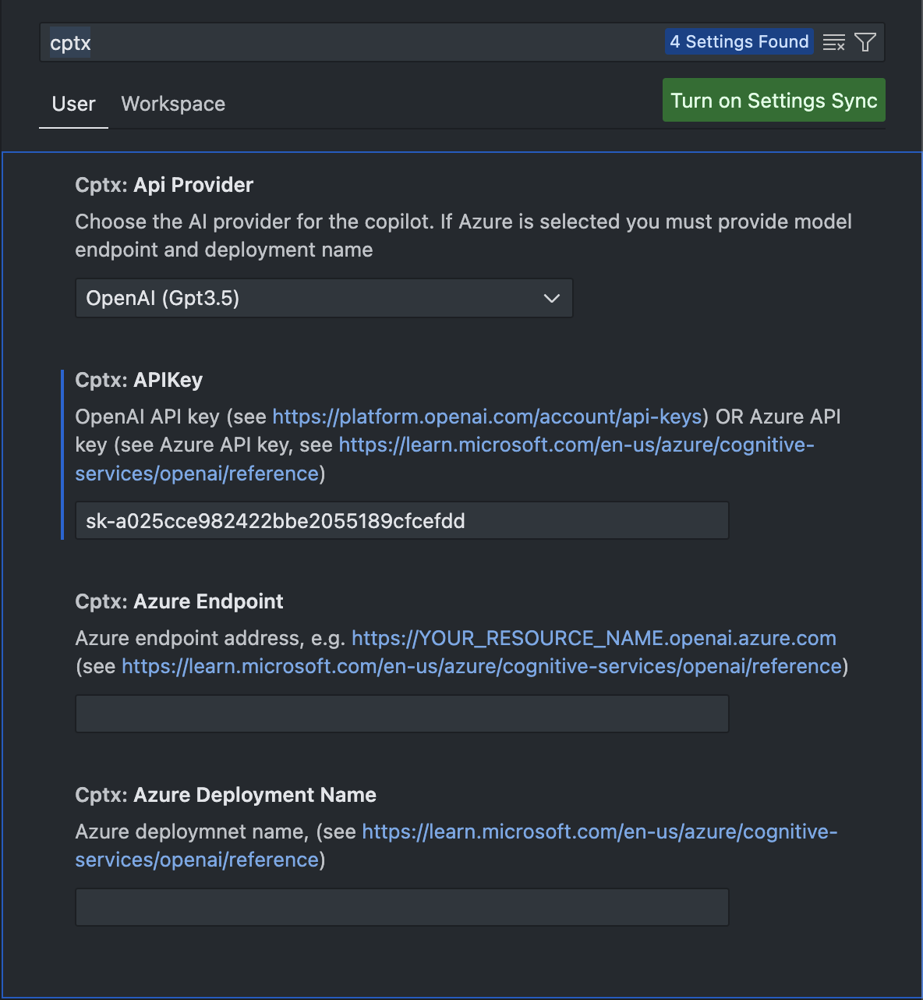
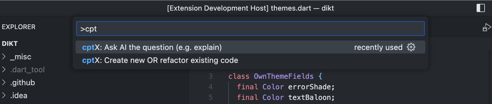

# Use ChatGPT as your (almost)free copilot
Save time not copying and pasting code between VSCode and ChatGPT window. The extension provides ChatGPT with context (code surrounding cursor or selection), primes the model by asking it to act as an expert in the given technology/language, sends your prompt and inserts the returned code block to editor.

The extension is a great addition to Amazon CodeWhisperer or Github Copilot if you are missing the ability to explicitly ask of a larger task OR don't like suggestions that are continuously generated.

## How to use
0. OpenAI API key must be provided before the extension is used
1. Go to https://platform.openai.com/account/api-keys and create a new key, copy it
2. Open VSCode Settings (File → Preferences → Settings *OR* Code → Settings → Settings) and paste the key

    

3. Open file in editor and select code of interest of put cursor at the desired location
4. Open up Command Palette (⇧⌘P on macOS, Ctrl + Shift + P on Windows and Linux) and type "cptx"
5. Choose any of the 2 commands:
    - cptX: Create new OR refactor existing code
    - cptX: Ask AI the question (e.g. explain)

    

6. Hit enter and wait for extension to complete the request

## Features
- Polyglot, can be used with any language
- Refactor selected code
- Insert new code at the current cursor location
- Ask for advice or explanation
- Based on 'gpt-3.5-turbo' model by OpenAI

## Limitations
- The context is limited by whatever code is in the current file, no knowledge of project structure or other files
- The extension doesn't add imports when new dependencies are introduced in the created code

## How is it different from Amazon CodeWhisperer and GitHub Copilot
- Unlike CodeWhisperer the extension can work with any programming language or technology. E.g. Flutter and Dart are supported (while not available in CodeWhisperer)
- It is not an uncommon opinion over the internet (as of April 2023) that ChatGPT is better at coding than above options.
- It's almost free. CoPilot costs you $20 monthly or $100 yearly. With this extension even with heavy usage it's unlikely you'll exceed $1 monthly bill for OpenAI usage.
- Oh, and you don't have to enter credit card details (as with GH Copilot) to start the free 3 month trial with $5 monthly quota for OpenAI API calls (as of April 2023).
- The extension is explicit is use, i.e. it doesn't work in the background and doesn't interfere by constantly suggesting code and moving lines around -> you request something and you get a response.

## Release Notes

### 0.0.3
- Cancelation fixed
- Explanation fixed
- Typos in Readme

### 0.0.2

Description texts fixed

### 0.0.1

Initial release of the the extension