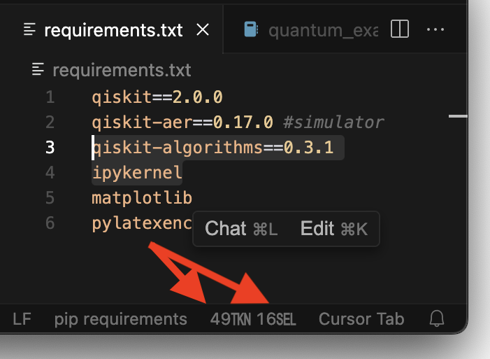
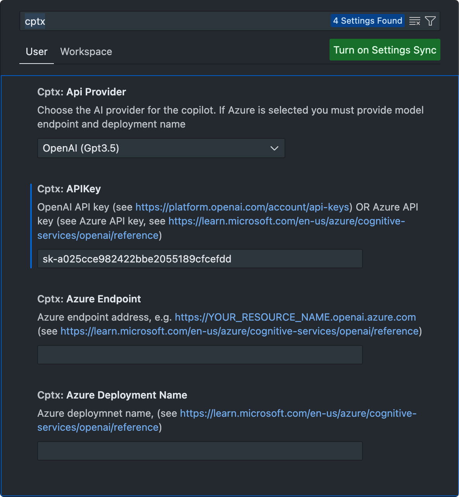
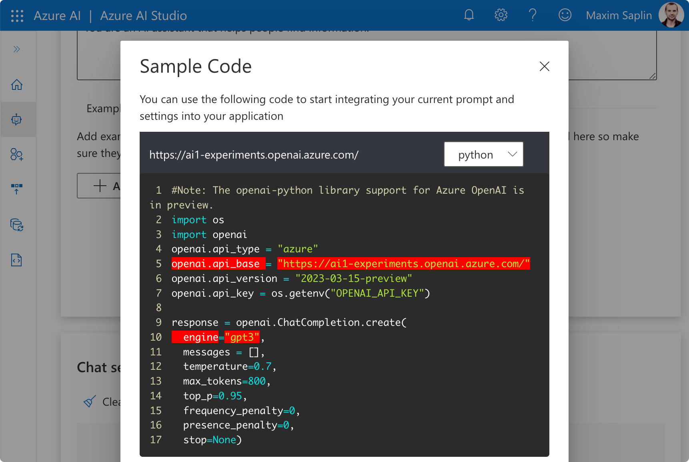

# Simplistic AI-Codegen, Token counter

**The plugin includes a neat token counter, displaying the current document size in the status bar (bottom right corner of the window):**

-----------

cptX is a headless AI coding assistant with simplicity in mind:
- 2 commands (Create and Ask)
- No UI
- Instruction following, you explicitly write a prompt and get the result 

It is good for quick small changes on a selected code (think 'smart refactor') OR getting code advice without switching windows:
- `Request↔Response` without conversation
- When creating code, language model response is plugged into editor right away:
  - replacing selected code block 
  - or inserting code at the current cursor location
- When asking, a simple popup with reply is displayed

The extension collects context (code surrounding cursor or selection) and primes the model by asking it to act as an expert in the given technology/language. It's doing it's best to ensure plug-ability of generated code into current selection/cursor location.

OpenAI or Azure API key/subscription are required and provided via extension settings *(see configuration instructions below)*.

## Features

- Polyglot, can be used with any language
- Minimalistic, just 2 commands in the command palette, no UI
- Change or refactor selected code
- Insert new code at the current cursor location
- Ask for advice or an explanation
- Timing the requests, token stats (prompt|completion)
- Set larger model context size (default is 4096) and utilize whole file contents
- Showing explanation in a new tab OR a simple popup
  - When a new tab is used history of `explain` requests is preserved
- Choose between OpenAI and Microsoft Azure as backends

## Two Commands

Open Command Palette (**`⇧ + ⌘ + P`** on macOS, **`Ctrl + Shift + P`** on Windows and Linux) and type "cptx":
- cptX 〉Create · Refactor
- cptX 〉 Ask · Explain
  
    

## Getting started with OpenAI

*Prerequisites:*
You need an OpenAI free trial or paid account.

*Configuring and using the extension:*
1. Go to https://platform.openai.com/account/api-keys and create a new key, copy it
2. Open VSCode Settings (File → Preferences → Settings *OR* Code → Settings → Settings), type "cptx" and paste API key

    
    
   Make sure you have the API provider set to "OpenAI (Gpt3.5)" and leave Azure params empty

3. Open a file in the editor and select the code of interest or put the cursor at the desired location
4. Open up Command Palette (⇧⌘P on macOS, Ctrl + Shift + P on Windows and Linux) and type "cptx"
5. Choose any of the 2 commands:
    - cptX 〉Create · Refactor
    - cptX 〉 Ask · Explain

6. Hit enter and wait for the extension to complete the request

## Getting started with Azure

Azure requires a few more steps as OpenAI models require custom deployments before use.

*Prerequisites:*
- An active MS Azure subscription with credits available (e.g. free monthly credits assigned for within Professional/Enterprise subscription)
- As of August 2023, OpenAI services can not be created right, Microsoft approval needs to be requested
    - When creating an OpenAI service in Azure Portal there's a link to the waitlist form, fill it out and give a couple of days for confirmation from MS
    - Gpt4 has a separate waitlist and a separate form that can be filled when you are granted access to OpenAI Services
- You have created Azure OpenAI service/endpoint in Azure Portal (https://portal.azure.com)
- For this endpoint, you have created a deployment in Azure AI Studio (https://oai.azure.com/portal)

*Configuring and using the extension:*
1. Go to https://oai.azure.com/portal and open chat playground
    - You can click in the right top corner and pick an endpoint/resource if there're multiple
2. Click the "View code" button under the "Chat Session" pane, here you can find the 3 params required by the extension
    - Endpoint (`openai.api_base`)
    - Deployment (`engine`)
    - API Key (scroll down to the bottom of the pop-up)
      

      

3. Open VSCode Settings (File → Preferences → Settings *OR* Code → Settings → Settings), type "cptx" 

    
    
    - Set API provider to "Azure (Gpt3.5 or Gpt4)"
    - Paste the API key, endpoint, and model

4. Open a file in the editor and select the code of interest or put the cursor at the desired location
5. Open up Command Palette (⇧⌘P on macOS, Ctrl + Shift + P on Windows and Linux) and type "cptx"
6. Choose any of the 2 commands:
    - cptX 〉Create · Refactor
    - cptX 〉 Ask · Explain

7. Hit enter and wait for the extension to complete the request

## Limitations

- LLMs/GPT are non-deterministic. If you don't get what you want from the first attempt - iterate, experiment.
    - Unlike standard refactoring tools, which rely on static analysis/deterministic logic and produce the right result from 1st attempt, be ready to check and fix the product of LLM/GPT
- The context is limited by whatever code is in the current file, no knowledge of project structure or other files
    - The extension gathers all lines around cursor/selection, by default up to 4096 tokens (~3000 words), can be overridden in extension settings by setting larger context
- The extension can't make multiple changes to one file, a single code block is inserted at the cursor location OR replacing selection
- The extension doesn't add imports when new dependencies are introduced in the created code

## Model Context Size

One of the key limiting factors to LLM practical applications is the context size. The original GPT-3.5 model had a context size of 4k tokens, GPT4 had versions with 8k and 32k context window sizes, newer models reach 128K. Upon approaching model's context limit its' performance degrades.

A typical 100 line source code file is approximately 600-700 tokens. The extension allows defining the context size limit (via settings) only collecting as much code as can fit into the context. The default value is 4k. 67% in the context window is reserved for prompt tokens (those ones sent to the API) and the rest 33% for completion tokens (tokens generated by LLM, context limit applies to both request and response).

To better understand the boundaries and consumption of tokens the extension has 2 neat features:

1. Displaying status bar counter, that shows the total number of tokens in the currently open file, and number of tokens in the selected code block. The counter is based on OpenAI's tiktoken ("o200k_base" encoding), Anthropic, Google and other models use tokenizers that give compareable token counts when it comes to code:

      

2. Displaying prompt and total (prompt + completion) tokens upon request completion:

      

## Privacy

The extension relies on APIs and cloud services by OpenAI and Microsoft. Both OpenAI and Azure state that they don't use prompts sent to APIs for training or improving models, the data you put into models can't leak into base models:
- Azure [privacy statement](https://learn.microsoft.com/en-us/legal/cognitive-services/openai/data-privacy#is-customer-data-processed-by-azure-openai-sent-to-openai) says that:
    - Customer data processed by Azure OpenAI is not sent to OpenAI
    - And not used to train the OpenAI models
    - It is possible to [opt out](https://learn.microsoft.com/en-us/legal/cognitive-services/openai/data-privacy?context=%2Fazure%2Fcognitive-services%2Fopenai%2Fcontext%2Fcontext#can-a-customer-opt-out-of-the-logging-and-human-review-process) of the logging and human review process
- OpenAI [data usage policies](https://openai.com/policies/api-data-usage-policies) say that no data submitted via API is used for training or improving their models

The extension does not use the public chat at https://chat.openai.com/ which was the source of news around leaks (user prompts used for training) and bans (explicitly restricting employees from using ChatGPT for work-related matters).

## Tips and Tricks

- "Check for bugs" request in 'cptX: Ask AI the question (e.g. explain)' - you can select ~100-300 lines (~2000k context) and ask to verify what's written, the extension is good at spotting minor issues (e.g. had this trailing comma in SQLite query which drove me crazy with runtime exceptions)

### Telemetry

The extensions collect essential telemetry via standard VSCode library (https://github.com/Microsoft/vscode-extension-telemetry#readme - same library used by VSCode itself). It respects user settings, if in VSCode you opt-out of sharing data telemetry won't be sent (that is ensured by the library). The kind of data shared doesn't include any sensitive information (such as prompt texts, generated codes, API keys), but rather the fact of issuing a command, timings, token consumption, context size, and kind of model used.

## Release Notes

### 1.0.7
 - API key not verified on start allowing zer-config token counter usage
 - Changed tokenizer to "o200k_base"
 - Updated dependencies
 - Renamed config options for API type

### 1.0.6
 - Plugin dependencies updated to most recent version
 - Opening explanation in MD previewer by default

### 1.0.5
 - Metadata updates

### 1.0.4 
 - Updated prompts for better plug-ability of the result
 - A new Setting to show explanation in markdown previewer rather than in standard dialog box
 - When markdown previewer is enabled history of the explanation will be stored in .cptx folder at the root of the project

### 1.0.3
 - Better support of Bash and Shell scripts

### 1.0.2
 - Updates to 'create' prompt
 - Status bar shows token count in the open editor
 - Minor prompt fix for Python

### 1.0.1
 - Shorter command names
 - Updates to README

### 1.0.0
 - New prompts for better results (system message, multiple user messages)
 - LLM context size can be defined in settings
 - Tokenizer for better management of context size (tiktoken)
 - VSCode Telemetry

### 0.0.9
 - Updated Microsoft openai client library fixing Azure auth (https://github.com/Azure/azure-sdk-for-js/issues/26021) 

### 0.0.8
 - More detailed error message (e.g. API not available)

### 0.0.7
 - Added support for Azure OpenAI endpoints (Gpt3.5 and Gpt4)
 - Extended Readme 

### 0.0.6
- Verbose error detail if OpenAI call is failed

### 0.0.5
- Created code is formatted (Format selection)

### 0.0.4
- Time reporting fixed for create or refactor
- More language profiles for AI priming (Dart, JavaScript, TypeScript, Python, Java, C#, Go, Ruby, Rust, HTML, CSS, JSON, YAML, C, C++, Swift, Objective-C, Objective-C++, Kotlin)
- Readme fixes

### 0.0.3
- Cancellation fixed
- Explanation fixed
- Typos in Readme

### 0.0.2

Description texts fixed

### 0.0.1

Initial release of the the extension
